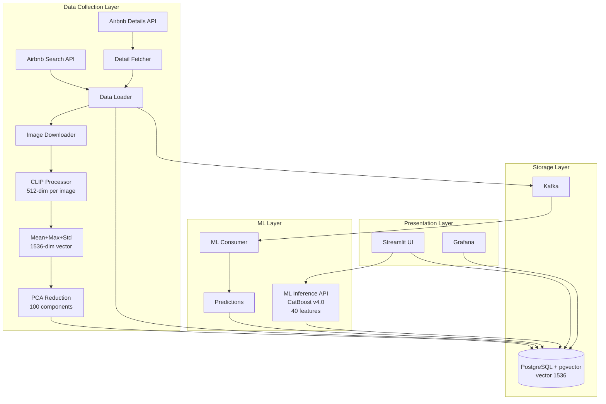

# Multimodal Real Estate Price Prediction System

End-to-end MLOps система для предсказания цен на недвижимость на основе изображений и метаданных с использованием мультимодального машинного обучения.

## Бизнес-ценность

### Проблема
На рынке недвижимости определение справедливой цены аренды - сложная задача, требующая экспертных знаний и анализа множества факторов. Владельцы недвижимости часто переоценивают или недооценивают свои объекты, что приводит к:
- Длительному простою объектов (переоценка)
- Потере потенциальной прибыли (недооценка)
- Неэффективному использованию рыночных данных
- Субъективности в оценке визуальных характеристик (интерьер, расположение, вид)

### Решение
Мультимодальная ML-система, которая автоматически анализирует:
- **Визуальные характеристики** - извлечение признаков из фотографий через CLIP embeddings
- **Метаданные** - местоположение, количество комнат, рейтинг, тип недвижимости
- **Рыночные данные** - сравнение с похожими объектами в базе данных

### Бизнес-ценность

**Для владельцев недвижимости:**
- Мгновенная оценка справедливой рыночной цены
- Объективная оценка на основе данных, а не интуиции
- Оптимизация прибыли (найти баланс между высокой ценой и быстрой арендой)
- Понимание факторов, влияющих на цену (feature importance)

**Для платформ недвижимости (Airbnb, Booking.com и т.д.):**
- Автоматизация рекомендаций по ценообразованию
- Улучшение заполняемости объектов
- Персонализированные рекомендации для хозяев
- Аналитика и мониторинг рыночных трендов

**Для инвесторов и аналитиков:**
- Анализ рыночных трендов в реальном времени
- Выявление недооцененных объектов
- Понимание влияния визуальных факторов на цену
- Мониторинг изменений на рынке

### Метрики успеха
- **Скорость обработки:** < 100ms на одно предсказание
- **Масштабируемость:** обработка 100+ запросов в минуту
- **Покрытие:** поддержка основных рынков недвижимости (NYC, LA)
- **Цель:** улучшение до MAPE < 25% при расширении датасета до 5,000+ листингов

## Описание проекта

End-to-end MLOps система, которая собирает данные о недвижимости из Airbnb API, обрабатывает изображения через CLIP для извлечения визуальных признаков, хранит данные в PostgreSQL с расширением pgvector для векторного поиска, и предоставляет ML-сервис для предсказания цен. Система построена на микросервисной архитектуре с использованием Docker и Kubernetes-ready компонентов.

## Архитектура



### Компоненты системы

| Компонент | Описание | Порт |
|-----------|----------|------|
| Data Loader | Сбор данных из Airbnb API, обработка изображений через CLIP | - |
| PostgreSQL | База данных с pgvector для векторного поиска | 5433 |
| Kafka | Брокер сообщений для асинхронной обработки | 9093 |
| ML Inference | FastAPI сервис для предсказания цен | 8000 |
| Streamlit UI | Веб-интерфейс для инференса и аналитики | 8501 |
| Grafana | Дашборды для мониторинга | 3000 |

## Требования

- Docker и Docker Compose
- Python 3.12+ (для локального запуска)
- RapidAPI ключ для Airbnb API

## Установка

1. Клонируйте репозиторий

2. (Опционально) Создайте файл `.env` на основе `.env.example`:

```bash
cp .env.example .env
```

**Примечание:** Для запуска проекта с существующими данными `.env` файл не обязателен. Все переменные имеют дефолтные значения в `docker-compose.yml`. `RAPIDAPI_KEY` нужен только если вы хотите собирать новые данные через API.

3. Если нужен сбор данных, заполните в `.env`:

```env
RAPIDAPI_KEY=your_rapidapi_key_here
RAPIDAPI_HOST=airbnb19.p.rapidapi.com
PLACE_ID=ChIJq0fR1gS8woAR0R4I_XnDx9Y,ChIJ4zPwIdm-woARpyaKDi1M5FA,ChIJ_9Ei1Yq-woAR9XfBG9YrXlA,ChIJGQCRws6kwoARq_Uj_7UKF7Q,ChIJ8dXnU9ekwoAROOxLORAMcwE,ChIJm6deTdekwoARTY_RzhoRms0
MAX_LISTINGS=4120
MAX_IMAGES_PER_LISTING=20
```

## Запуск

### Через Docker Compose (рекомендуется)

Для запуска проекта с существующими данными:
sh
# Запустить все сервисы (UI, ML API, Grafana, БД, Kafka)
docker-compose up -d

# Проверить статус
docker-compose ps

# Открыть интерфейсы
# UI: http://localhost:8501
# API: http://localhost:8000/docs
# Grafana: http://localhost:3000 (admin/admin)

### Сбор новых данных (опционально)

Если нужно собрать новые данные через Airbnb API:

# 1. Убедитесь что .env файл содержит RAPIDAPI_KEY
# 2. Запустите инфраструктуру
docker-compose up -d postgres zookeeper kafka
# Подождите пока сервисы запустятся (30-60 секунд)
# 3. Запустите data loader (будет собирать данные и обрабатывать изображения)
docker-compose up data_loader

**Примечание:** Сбор данных может занять много времени (20-30 минут для 240 объявлений). Для проверки проекта это не требуется - используйте существующие данные в БД.


### Локальный запуск (Apple Silicon)

1. Установите зависимости:
```bash
pip install -r requirements.txt
```

2. Запустите PostgreSQL и Kafka через docker-compose:
```bash
docker-compose up -d postgres zookeeper kafka
```

Or just this to make sure grafana works too
```bash
docker-compose up -d 
```

# Для сбора данных
3. Запустите data loader локально:
```bash
cd services/data_loader
python main.py
```

## Структура проекта

```
project/
├── docker-compose.yml
├── .env.example
├── README.md
├── ONEPAGER.md              # описание проекта на 1 странице
├── PROJECT_STATUS.md        # статус реализации
├── services/
│   ├── data_loader/         # сбор данных из API
│   │   ├── main.py
│   │   ├── api_client.py
│   │   ├── image_processor.py
│   │   └── ...
│   ├── ml_inference/        # ML сервис
│   │   ├── app.py           # FastAPI
│   │   ├── predictor.py
│   │   ├── models/          # обученные модели
│   │   └── ...
│   └── ui/                  # Streamlit UI
│       ├── app.py
│       └── pages/           # страницы UI
├── grafana/                 # конфигурация Grafana
│   ├── provisioning/
│   └── dashboards/
├── scripts/
│   └── init_db.sql
└── data/
    ├── raw/                 # JSON ответы от API
    └── images/              # скачанные изображения
```

## Компоненты

### API Client (`api_client.py`)
- Асинхронный HTTP клиент для Airbnb API
- Обработка пагинации через `nextPageCursor`
- Retry logic и rate limiting
- Сохранение сырых JSON ответов

### Image Downloader (`image_downloader.py`)
- Асинхронное скачивание до 20 изображений на объявление
- Batch processing с semaphore для контроля concurrency
- Обработка ошибок и пропуск уже скачанных изображений

### Image Processor (`image_processor.py`)
- Resize изображений до 224x224 с сохранением aspect ratio
- Извлечение CLIP embeddings через `openai/clip-vit-base-patch32` (512-мерные векторы)
- Поддержка MPS backend для Apple Silicon

### Embedding Aggregator (`embedding_aggregator.py`)
- Mean+Max+Std aggregation для агрегации эмбеддингов всех изображений
- Результат: один 1536-мерный вектор на объявление (Mean 512 + Max 512 + Std 512)
- PCA reduction: 1536 → 100 компонент (81% variance)

### Database Service (`database.py`)
- Сохранение метаданных и эмбеддингов в PostgreSQL
- Использование pgvector для векторного поиска
- Upsert логика для обновления существующих записей

### Kafka Producer (`kafka_producer.py`)
- Отправка обработанных объявлений в Kafka топик `new_listings`
- Формат: JSON с listing_id и embedding

## База данных

Таблица `listings`:
- `id` (VARCHAR) - ID объявления
- `price` (FLOAT) - Цена
- `lat`, `lng` (FLOAT) - Координаты
- `name` (TEXT) - Название
- `rating` (FLOAT) - Рейтинг
- `embedding` (vector(1536)) - Mean+Max+Std CLIP embedding
- `city` (VARCHAR) - Город/район
- `property_type`, `room_type` - Тип недвижимости
- `person_capacity`, `bedrooms`, `beds`, `bathrooms` - Характеристики
- `cleanliness_rating`, `location_rating`, `value_rating`, etc. - Детальные рейтинги
- `review_count` - Количество отзывов
- `description` (TEXT) - Описание
- `created_at` (TIMESTAMP) - Время создания

Таблица `listing_amenities`:
- `listing_id` (VARCHAR) - ID объявления
- `amenity` (VARCHAR) - Название удобства

Индексы:
- IVFFlat индекс на embedding для быстрого векторного поиска
- Индексы на price и location

## Проверка результатов

### PostgreSQL
```bash
docker-compose exec postgres psql -U mlops -d real_estate

# Проверить количество записей
SELECT COUNT(*) FROM listings;

# Посмотреть примеры
SELECT id, name, price, rating FROM listings LIMIT 10;

# Проверить embeddings (должны быть 1536-мерные)
SELECT id, array_length(embedding::float[], 1) as embedding_dim FROM listings LIMIT 5;

# Проверить детальные данные
SELECT id, city, property_type, person_capacity, bedrooms, review_count FROM listings WHERE city IS NOT NULL LIMIT 10;
```

### Kafka
```bash
# Проверить топик
docker-compose exec kafka kafka-topics --bootstrap-server localhost:9092 --list

# Просмотреть сообщения
docker-compose exec kafka kafka-console-consumer \
  --bootstrap-server localhost:9092 \
  --topic new_listings \
  --from-beginning
```

### Изображения
```bash
# Проверить количество скачанных изображений
find data/images -name "*.jpg" | wc -l

# Посмотреть структуру
ls -la data/images/
```

## Логи

Логи сохраняются в:
- Консоль (stdout)
- Файлы в директории `data/` (если указан `LOG_DIR`)

## Производительность

Оптимизации для Apple Silicon:
- Использование MPS backend для CLIP модели
- Высокий уровень concurrency (50 для скачивания изображений)
- Batch processing для эффективного использования памяти
- Semaphore для контроля нагрузки

Ожидаемое время обработки 240 объявлений:
- ~20-30 минут (зависит от количества изображений и скорости сети)

## Troubleshooting

### Ошибка подключения к PostgreSQL
```bash
docker-compose logs postgres
docker-compose ps
```

### Ошибка подключения к Kafka
```bash
docker-compose logs kafka
# Убедитесь что Kafka healthy
docker-compose ps kafka
```

### Проблемы с MPS
Если MPS не доступен, код автоматически переключится на CPU. Проверьте:
```python
import torch
print(torch.backends.mps.is_available())
```

### Нехватка памяти
Уменьшите `MAX_IMAGES_PER_LISTING` или `MAX_LISTINGS` в `.env`

## Веб-интерфейсы

После запуска доступны:

- **Streamlit UI**: http://localhost:8501 - главный интерфейс для инференса и аналитики
- **ML API Swagger**: http://localhost:8000/docs - документация REST API
- **Grafana**: http://localhost:3000 - мониторинг (admin/admin)

## Быстрый старт

```bash
# 1. Клонировать репозиторий
git clone <repository-url>
cd project

# 2. (Опционально) Создать .env файл для сбора новых данных
# cp .env.example .env
# Для запуска с существующими данными .env не нужен

# 3. Запустить все сервисы
docker-compose up -d

# 4. Открыть UI
open http://localhost:8501
```

## Статус проекта

Все компоненты реализованы:
- Data Loader с CLIP embeddings (Mean+Max+Std aggregation)
- PostgreSQL с pgvector (vector(1536))
- Kafka для асинхронной обработки
- ML Inference Service (CatBoost v4.0 с feature selection и Optuna tuning)
- Streamlit UI с аналитикой
- Grafana мониторинг

### Модель v4.0
- **Embeddings**: Mean+Max+Std (1536 dims) → PCA to 100 dims (81% variance)
- **Features**: 40 selected features (from 164 total, 79.2% importance)
- **Hyperparameters**: Optuna-tuned (30 trials)
- **Performance**: Cross-validation MAPE 60.1% ± 4.1%

Подробный статус: [PROJECT_STATUS.md](PROJECT_STATUS.md)

## Лицензия

Проект для образовательных целей.

